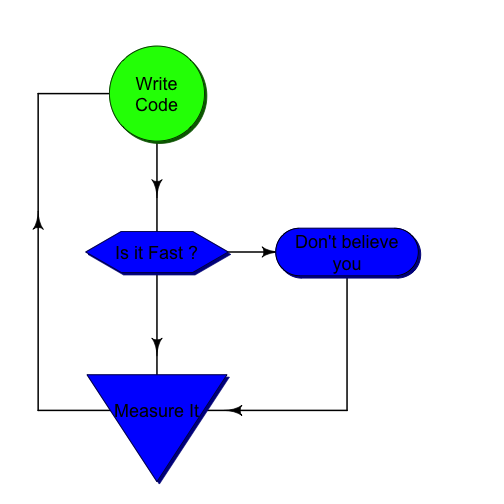

---
title       : Améliorer les performances de R
subtitle    : 2014-2015
author      : Matthias Oehler
job         : Vice Président Data @Makazi
github      : {user: oehlr, repo: slide-introdatascience-session3}
framework   : io2012        # {io2012, html5slides, shower, dzslides, ...}
highlighter : highlight.js  # {highlight.js, prettify, highlight}
hitheme     : tomorrow      # 
widgets     : [bootstrap]            # {mathjax, quiz, bootstrap}
mode        : selfcontained # {standalone, draft}
knit        : slidify::knit2slides
logo        : logods.png
biglogo     : logo_polytech.jpg
--- { tpl: mkz-cols-thumbs, 
      description: ""}


## Sommaire - Session 3


--- &mkz-section2 bg:#00B7BE img:white_nuclearidea.png

# MESURER LA PERFORMANCE

---  { tpl: slide_clean,
       description: ""}

## Introduction




---  { tpl: slide,
       description: "L'analyse du code est necessaire lorsque les temps de traitement ne sont plus raisonnables compte tenu de l'objectif donné à l'algorithme. Ou parce que l'analyse est impossible car trop longue."}

## Analyser

* Identifier les goulots d'étranglement d'un code peut être très chronophage dès lors que le nombre de ligne de code devient élevé
* C'est cependant une étape indispensable pour examiner les temps de traitement de chaque partie du programme
* Le programme peut fonctionner assez rapidement sur le jeu de données test mais qu'en sera t'il sur des "vrais" données 
* Ce doit etre un reflexe chez le Data Scientist

---  { tpl: slide,
       description: "la fonction system.time retourne le temps CPU (entre autre) de l'expression utilisée"}

## System.time()


```r
# Calcul de la somme cumulée du vecteur x
x <- runif(2e4)
system.time({
  cusum <- NULL
  for (i in 1:length(x)) cusum <- c(cusum,sum(x[1:i]))
})
```

```
   user  system elapsed 
  3.099   1.064   4.167 
```

* `user` correspond au temps CPU chargé de l'éxecution de l'appel des instructions utilisateur
* `system` correspond au temps CPU chargé de l'éxecution coté système

<div class="alert alert-info" role="alert"><b>Question :</b> Comment améliorer cette fonction ?
</div>


---  { tpl: slide,
       description: "la fonction system.time retourne le temps CPU (entre autre) de l'expression utilisée"}

## System.time()


```r
# Calcul de la somme cumulée du vecteur x
x <- runif(2e4)
system.time({
  cusum <- numeric(length(x))
  for (i in 1:length(x)) cusum[i] <- sum(x[1:i])
})
```

```
   user  system elapsed 
  2.537   0.675   3.222 
```

* <u>Modification</u> : Préparation du vecteur de résultat
* Gain de **25% de temps**

<div class="alert alert-info" role="alert"><b>Question :</b> Mais encore ... ?
</div>


---  { tpl: slide,
       description: "la fonction system.time retour le temps CPU (entre autre) de l'expression utilisée"}

## System.time()


```r
# Calcul de la somme cumulée du vecteur x
x <- runif(2e4)
system.time({
  cusum <- x
  for (i in 2:length(x)) cusum[i] <- cusum[i-1]+cusum[i]
})
```

```
   user  system elapsed 
  0.039   0.000   0.038 
```

* <u>Modification</u> : Suppression des calculs répétitifs des sum
* **100x plus rapide** que la version précédente

<div class="alert alert-info" role="alert"><b>Question :</b> On peut faire mieux encore mieux ?
</div>


---  { tpl: slide_clean}

## System.time()


```r
# Calcul de la somme cumulée du vecteur x
x <- runif(2e4)
system.time({
  cusum <- cumsum(x)
})
```

```
   user  system elapsed 
      0       0       0 
```

Hum ??? Est ce que cela a vraiment marché ? Essayons avec un vecteur 100x plus grand


```r
x<- runif(2e6) # avec un vecteur 100x plus grand ?
system.time(cusum <- cumsum(x))
```

```
   user  system elapsed 
  0.013   0.004   0.017 
```

Yes !

--- .segue .quote .white

<q>Ok bien compris. Mais en plus simple ?</q>

<style>
.dark q {
  color: white;
}
</style>

---  { tpl: slide,
         description: "Microbenchmark permet de mesurer et comparer les temps d'exécution d'expression R."}

## Microbenchmark (package)


```r
f1 <- function(x) {
  cusum <- NULL
  for (i in 1:length(x)) cusum <- c(cusum,sum(x[1:i]))
}

f2 <- function(x) {
  cusum <- numeric(length(x))
  for (i in 1:length(x)) cusum[i] <- sum(x[1:i])
}

f3 <- function(x) {
  cusum <- x
  for (i in 2:length(x)) cusum[i] <- cusum[i-1]+cusum[i]
}

f4 <- function(x) {
  cusum <- cumsum(x)
}
```


---  { tpl: slide,
         description: "Microbenchmark permet de mesurer et comparer les temps d'exécution d'expression R."}

## Microbenchmark (package)


```r
library(microbenchmark)
x<-runif(1e3)
microbenchmark(f1(x),f2(x),f3(x),f4(x))
```

```
Loading required namespace: multcomp
```

```
Unit: microseconds
  expr      min       lq     mean median       uq   max neval
 f1(x) 8103.796 8800.146 13341.73  10937 18580.26 23007   100
 f2(x) 7035.700 7795.010 10592.14   8443 10791.17 22588   100
 f3(x) 1646.538 1713.178  2088.85   1787  1988.32 11603   100
 f4(x)    5.688    6.926    10.53     11    12.31    22   100
```

* Un même résultat peut etre obtenu de plusieurs manières différents. Mais il y a un fable nombre de "bonnes" manières. Ici, la bonne manière est **1000x plus rapide** que la mauvaise manière

<div class="alert alert-info" role="alert"><b>Conclusion :</b> Toujours préférer les fonctions natives et déjà compilées.
</div>


---  { tpl: slide,
       description: ""}

## Conclusion

* System.time et microbenchamrk permettent de comparer des bouts de code entre eux assez simplement
* Ils sont utiles lorsque l'on a identifié où le code prend du temps d'exécution
* Mais comment trouver les parties de code consommatrices de temps dans des milliers de lignes de code ?


---  { tpl: slide,
       description: "Utilisation de la puissance des serveurs pour les calculs."}

## Profiling du code R

* La fonction `Rprof()` lance le profiler de R

* La fonction `summaryRprof()` sort les statistiques à partir du fichier généré par `Rprof()`

* `Rprof()` n'est utile que si le temps d'exécution code est "mesurable" (> 1–10msecs)


```r
n <- 1e5
y <- gl(2, 100, n, labels = c("A","B"))
x <- runif(n)

Rprof(tmp <- tempfile())
lm(x ~ y)
Rprof()
srp <- summaryRprof(tmp)
unlink(tmp)
```

<div class="alert alert-info" role="alert"><b>Info :</b> tempfile() permet de générer un fichier vide dans un répertoire temporaire. Le fichier est supprimé par la fonction unlink()
</div>

---  { tpl: slide_clean,
       description: "Utilisation de la puissance des serveurs pour les calculs."}


```r
head(srp$by.self)
```

```
                        self.time self.pct total.time total.pct
"lm"                         0.06    27.27       0.22    100.00
"as.character"               0.06    27.27       0.06     27.27
".External2"                 0.04    18.18       0.08     36.36
"anyDuplicated.default"      0.02     9.09       0.02      9.09
"is.na"                      0.02     9.09       0.02      9.09
"structure"                  0.02     9.09       0.02      9.09
```


```r
print(head(srp$by.total))
```

```
                 total.time total.pct self.time self.pct
"lm"                   0.22    100.00      0.06    27.27
".External2"           0.08     36.36      0.04    18.18
"as.character"         0.06     27.27      0.06    27.27
"model.response"       0.06     27.27      0.00     0.00
"[.data.frame"         0.04     18.18      0.00     0.00
"["                    0.04     18.18      0.00     0.00
```


<div class="alert alert-info" role="alert"><b>Aller plus loin :</b> d'autres packages existent : Rprof, profr, lineprof
</div>

--- &mkz-section2 bg:#F39D01 img:white_nuclearidea.png

# LES BONNES PRATIQUES


---  { tpl: slide,
       description: "Utiliser les versions précompilées permet d'obtenir de meilleurs performances..."}

## SQRT


```r
x <- runif(100)
microbenchmark(
  sqrt(x),
  x ^ 0.5
)
```

```
Loading required namespace: multcomp
```

```
Unit: nanoseconds
    expr min    lq   mean median   uq  max neval
 sqrt(x) 683 715.5  902.4  780.5  853 9991   100
   x^0.5 848 867.0 1043.5  929.5 1044 8738   100
```

---  { tpl: slide,
       description: "... le contre-exemple parfait"}

## MEAN


```r
microbenchmark(
  "mean1" = mean(x),
  "mean2" = sum(x) / length(x)
)
```

```
Loading required namespace: multcomp
```

```
Unit: microseconds
  expr   min     lq  mean median     uq    max neval
 mean1 9.952 10.430 11.23 10.643 10.848   62.2   100
 mean2 2.156  2.368 80.31  2.478  2.567 7784.6   100
```


---  { tpl: slide,
       description: "Utilisation de la puissance des serveurs pour les calculs."}

## SQRT


```r
microbenchmark(
  "[32, 11]"      = mtcars[32, 11],
  "$carb[32]"     = mtcars$carb[32],
  "[[c(11, 32)]]" = mtcars[[c(11, 32)]],
  "[[11]][32]"    = mtcars[[11]][32],
  ".subset2"      = .subset2(mtcars, 11)[32]
)
```

```
Loading required namespace: multcomp
```

```
Unit: nanoseconds
          expr   min      lq    mean  median    uq   max neval
      [32, 11] 16799 17765.0 18969.2 18095.0 18837 63298   100
     $carb[32]  2079  2630.5  3006.7  2946.0  3190 10639   100
 [[c(11, 32)]]  6392  7622.0  8603.8  8228.5  8676 50032   100
    [[11]][32]  5685  6995.5  7674.2  7345.0  7938 17918   100
      .subset2   357   463.5   638.2   536.5   635  9725   100
```


---  { tpl: slide,
       description: "Utilisation de la puissance des serveurs pour les calculs."}

## SQRT


```r
x1 <- x2 <- x3 <- x4 <- runif(1000)

microbenchmark(
  "loop"        = for (i in 1:length(x1)) if(x1[i]<=0.5) x1[i] <- 0,
  "ifelse"      = x2 <- ifelse(x2 <= 0.5, x2, 0),
  "inplace"     = x3[x3<=0.5] <- 0,
  "inplace_whi" = x4[which(x4<=0.5)] <- 0
)
```

```
Loading required namespace: multcomp
```

```
Unit: microseconds
        expr     min      lq    mean  median      uq     max neval
        loop 1020.71 1085.27 1523.78 1355.79 1958.80 3856.46   100
      ifelse  162.45  166.81  204.71  190.08  231.43  407.60   100
     inplace   33.35   35.06   41.59   37.53   44.88   93.56   100
 inplace_whi   11.86   14.65   19.08   17.87   20.72   57.95   100
```


---  { tpl: slide,
       description: "Utilisation de la puissance des serveurs pour les calculs."}

## Prepare vectors


```r
f1 <- function() {
  x <- NULL; for (i in 1:10000) x<-c(x,i)
}
f2 <- function() {
  x <- numeric(10000); for (i in 1:10000) x[i]<i
}

microbenchmark(
  "extend" = f1(), "fill" = f2()
)
```

```
Loading required namespace: multcomp
```

```
Unit: milliseconds
   expr     min      lq    mean  median      uq    max neval
 extend 156.784 163.269 172.115 166.386 174.730 252.07   100
   fill   4.744   4.907   5.824   5.008   5.721  11.31   100
```


---  { tpl: slide,
       description: "Utilisation de la puissance des serveurs pour les calculs."}

## Compiler


```r
f <- function(x) {
  for (i in 2:length(x)) x[i] <- x[i-1]+x[i]; return(x)
}

library(compiler)
fc <- cmpfun(f)

microbenchmark(
  "original" = f(x), "compiled" = fc(x), "internal" = cumsum(x)
)
```

```
Loading required namespace: multcomp
```

```
Unit: nanoseconds
     expr    min     lq   mean median     uq    max neval
 original 187783 192763 205015 197127 201137 357625   100
 compiled  36947  43474  46624  45822  48375  64172   100
 internal    898   1030   1354   1180   1353   9088   100
```


---  { tpl: slide,
       description: "Utilisation de la puissance des serveurs pour les calculs."}

## data.table vs. data.frame


```r
n <- 1e5
DF <- data.frame(x=sample(c("a","b","c"),n,replace=T), y=runif(n), v=1:n)
DT <- data.table(x=sample(c("a","b","c"),n,replace=T), y=runif(n), v=1:n)
setkey(DT,x)
```

---  { tpl: slide,
       description: "Utilisation de la puissance des serveurs pour les calculs."}

## data.table vs. data.frame


```r
microbenchmark(
  "DF.subset" = nrow(DF[which(DF$x=="b"),]),
  "DT.subset" = nrow(DT["b",])
)
```

```
Loading required namespace: multcomp
```

```
Unit: milliseconds
      expr   min     lq   mean median     uq    max neval
 DF.subset 11.45 12.573 14.231 12.767 16.448 21.875   100
 DT.subset  1.67  2.085  2.344  2.149  2.297  7.226   100
```

---  { tpl: slide,
       description: "Utilisation de la puissance des serveurs pour les calculs."}

## data.table vs. data.frame


```r
microbenchmark(
  "DF.add" = DF$y <- 1,
  "DT.add" = DT[,y:=1]
)
```

```
Loading required namespace: multcomp
```

```
Unit: microseconds
   expr   min     lq   mean median     uq   max neval
 DF.add 957.7 2626.0 4776.1 3656.0 5380.1 86938   100
 DT.add 458.4  598.4  712.6  727.4  834.2  1135   100
```


---  { tpl: slide,
       description: "Utilisation de la puissance des serveurs pour les calculs."}

## Aggregate


```r
microbenchmark(
  "DF.aggregation" = aggregate(DF$y,list(DF$x),sum),
  "DT.aggregation" = DT[,y:=1]
)
```

```
Loading required namespace: multcomp
```

```
Unit: microseconds
           expr     min      lq    mean  median      uq    max neval
 DF.aggregation 69571.7 73596.9 79281.7 75168.3 77574.6 157016   100
 DT.aggregation   398.7   593.1   797.3   656.9   809.6   5717   100
```


--- &mkz-section2 bg:#00B7BE img:white_nuclearidea.png

# R & PACKAGE


--- &mkz-section2 bg:#00B7BE img:white_nuclearidea.png

# PRODUIT


